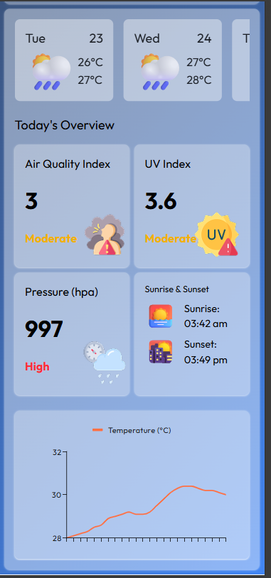

# Weather App

A modern, responsive weather dashboard that provides real-time weather insights, air quality monitoring, and 5-day forecasts with dynamic visual updates.


---

## Description

This project is a comprehensive weather dashboard built for users who need detailed environmental data beyond just temperature. It integrates multiple professional weather APIs to provide Air Quality Index (AQI), UV Index, and interactive temperature trends in a sleek, mobile-first interface.

---

## Screenshots / Demo

- **Live Demo:** https://react-weather-app-five-iota.vercel.app

<p align="center">
  
  
</p>

<p align="center">
  
  
</p>

### Dashboard Overview
- Desktop View  
- Mobile View  

---

## Features

- **Real-time Weather Data** – Temperature, humidity, wind speed, and pressure
- **Search Functionality** – Geocoding-enabled city search worldwide
- **Advanced Metrics**
  - AQI status with color indicators (Good / Moderate / Poor)
  - UV Index safety levels
- **Interactive Visuals**
  - 24-hour temperature chart
  - 5-day weather forecast
- **Dynamic UI**
  - Background gradients change based on time of day and weather conditions

---

## Tech Stack

### Frontend
- React (v19)
- Tailwind CSS (v4)

### Build Tool
- Vite (v7)

### Charting
- MUI X Charts
- Chart.js
- react-chartjs-2

### Routing
- React Router DOM (v7)

### APIs
- **OpenWeatherMap**
  - Current weather
  - 5-day forecast
  - Air Pollution data
- **Open-Meteo**
  - Geocoding (search)
  - UV Index
  - 15-minute interval metrics

---

## Installation & Setup

### Clone the repository
```bash
git clone https://github.com/Anugrah71/React-Weather-App.git
cd weather-app
